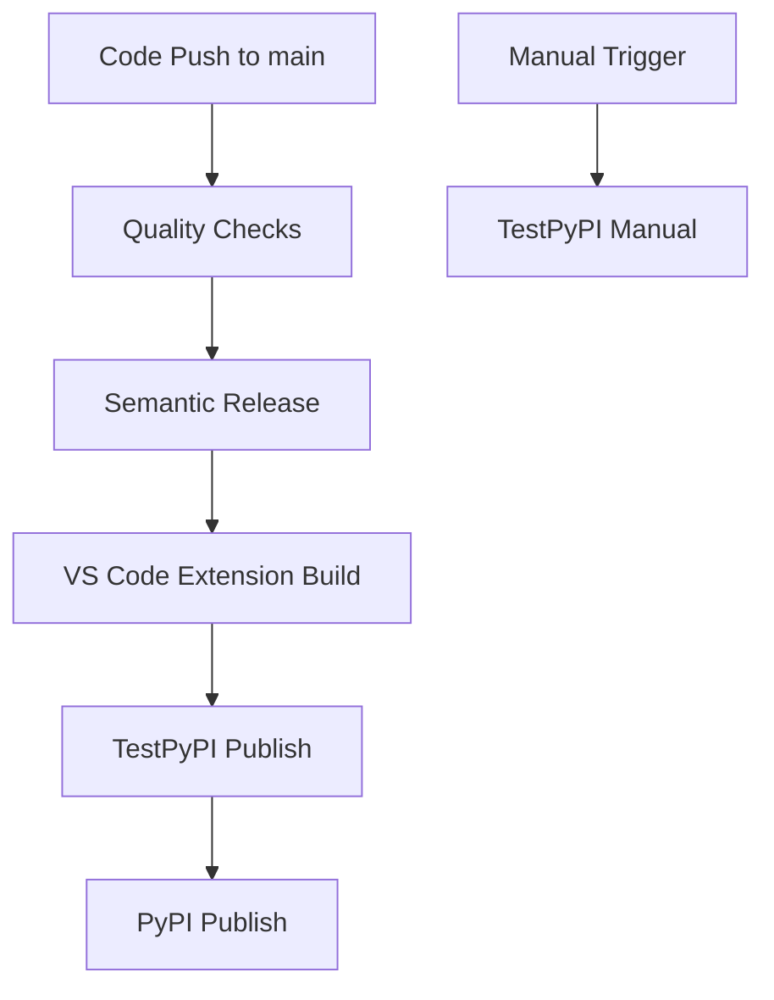

# Python Release Pipeline Guide

This document provides comprehensive guidance for the Python release pipeline implemented in this project.

## Pipeline Overview

Our release pipeline implements modern Python packaging best practices with automated quality gates, testing phases, and production deployment.

### Pipeline Stages



## 📋 Workflow Files

### 1. `.github/workflows/release.yml` - Main Release Pipeline

**Purpose**: Automated production releases triggered by pushes to main branch.

**Stages**:
- **Quality Checks**: Linting, testing, type checking, workflow validation
- **Semantic Release**: Automated versioning and changelog generation
- **VS Code Extension**: Build and publish extension to marketplace
- **TestPyPI Publish**: Validation publishing to test environment
- **PyPI Publish**: Production publishing (only if TestPyPI succeeds)

**Key Features**:
- Fail-safe mechanism: Each stage depends on previous success
- Test-first approach: TestPyPI validation before production
- Automated version management via semantic-release
- Quality gates prevent broken releases

### 2. `.github/workflows/publish-testpypi.yml` - Manual Testing

**Purpose**: Manual testing workflow for package validation and debugging.

**Use Cases**:
- Pre-release testing of specific versions
- Debugging packaging issues
- Validation of build process
- Testing before major releases

**Features**:
- Manual trigger with optional version selection
- Direct TestPyPI publishing
- Installation instructions provided
- Safe testing environment

## 🔧 Technical Implementation

### Version Management

**Strategy**: Git tag-based versioning with automated semantic release

```yaml
# pyproject.toml
[tool.hatch.version]
source = "vcs"

[tool.hatch.build.hooks.vcs]
version-file = "vibe/_version.py"
```

**Benefits**:
- Single source of truth (git tags)
- Automatic version generation
- Reproducible builds
- Clean version history

### Package Building

**Tool**: `uv build` for fast, reliable package creation

```bash
# Creates both distributions:
uv build
# -> dist/vibe_soren_n-X.Y.Z.tar.gz (source)
# -> dist/vibe_soren_n-X.Y.Z-py3-none-any.whl (wheel)
```

**Configuration**:
- Wheel and source distributions
- Metadata from pyproject.toml
- Dynamic versioning from VCS
- Deterministic builds

### Publishing Strategy

**Approach**: Two-stage publishing with validation

1. **TestPyPI First**: Validate package structure, metadata, and upload process
2. **PyPI Second**: Production publishing only after successful validation

**Authentication**: Trusted Publishing (OIDC)
- No stored tokens required
- Automatic authentication via GitHub Actions
- Secure, token-free publishing

## 🛡️ Safety Measures

### Quality Gates

Before any publishing occurs, all checks must pass:

```yaml
quality-checks:
  steps:
    - name: Check formatting (ruff format)
    - name: Lint code (ruff check)
    - name: Type checking (mypy)
    - name: Run tests (pytest)
    - name: Validate workflows
```

### Fail-Safe Dependencies

Each job depends on the previous stage:

```yaml
jobs:
  quality-checks: {...}
  release:
    needs: quality-checks
  testpypi-publish:
    needs: release
  pypi-publish:
    needs: testpypi-publish  # Won't run if TestPyPI fails
```

### Duplicate Upload Protection

Both workflows use `skip-existing: true` to prevent errors from duplicate uploads.

## 📦 Package Structure

### Project Layout

```
vibe/
├── vibe/                 # Main package
│   ├── __init__.py
│   ├── _version.py       # Auto-generated version file
│   └── ...
├── pyproject.toml        # Package configuration
├── README.md            # Package description
├── CHANGELOG.md         # Auto-generated changelog
└── dist/               # Built packages (gitignored)
```

### Package Configuration

**Key pyproject.toml sections**:

```toml
[project]
name = "vibe-soren-n"
dynamic = ["version"]
description = "AI-powered workflow orchestration"
dependencies = [...]

[tool.hatch.version]
source = "vcs"

[tool.hatch.build.hooks.vcs]
version-file = "vibe/_version.py"
```

## 🔍 Troubleshooting

### Common Issues

**1. Version Conflicts**
- **Problem**: Package already exists with same version
- **Solution**: Use `skip-existing: true` or increment version

**2. TestPyPI vs PyPI Name Conflicts**
- **Problem**: Package name taken on PyPI but not TestPyPI
- **Solution**: Test with actual package name, consider alternatives

**3. Authentication Failures**
- **Problem**: Publishing fails with 403 errors
- **Solution**: Check trusted publishing configuration on PyPI/TestPyPI

**4. Build Failures**
- **Problem**: Package build fails with missing files
- **Solution**: Check `[tool.hatch.build.targets.wheel]` configuration

### Debugging Workflow

1. **Check Quality Gates**: Ensure all quality checks pass locally
2. **Test Locally**: Build package with `uv build` and inspect
3. **Use Manual Workflow**: Test specific versions with TestPyPI manual workflow
4. **Check Logs**: Review GitHub Actions logs for specific error messages
5. **Validate Configuration**: Ensure pyproject.toml is correct

## 🎯 Best Practices

### Development Workflow

1. **Feature Development**:
   ```bash
   git checkout -b feature/new-feature
   # Develop feature
   git commit -m "feat: add new feature"
   git push origin feature/new-feature
   # Create PR to main
   ```

2. **Release Process**:
   ```bash
   # Merge PR to main
   git checkout main
   git pull origin main
   # Automatic release triggered by semantic-release
   ```

### Commit Messages

Use [Conventional Commits](https://www.conventionalcommits.org/) for automatic version bumps:

- `feat:` → Minor version bump (new feature)
- `fix:` → Patch version bump (bug fix)
- `feat!:` or `BREAKING CHANGE:` → Major version bump

### Testing Strategy

1. **Pre-release**: Use manual TestPyPI workflow for critical releases
2. **Validation**: Test installation from TestPyPI before production
3. **Monitoring**: Check PyPI package page after release

### Package Naming

- Use clear, descriptive names
- Follow PyPI naming conventions
- Consider namespace packages for organization projects
- Check availability on both PyPI and TestPyPI

## 📚 Resources

### Documentation
- [Python Packaging User Guide](https://packaging.python.org/)
- [Semantic Release Documentation](https://semantic-release.gitbook.io/)
- [PyPI Trusted Publishing](https://docs.pypi.org/trusted-publishers/)
- [uv Documentation](https://docs.astral.sh/uv/)

### Tools
- **uv**: Fast Python package manager and build tool
- **semantic-release**: Automated versioning and publishing
- **hatch-vcs**: Version control system integration
- **gh-action-pypi-publish**: Secure PyPI publishing action

### Example Commands

```bash
# Local development
uv sync                           # Install dependencies
uv run pytest                    # Run tests
uv run ruff check                 # Lint code
uv run mypy vibe                  # Type check

# Local packaging
uv build                          # Build package
uv run twine check dist/*         # Validate package
uv run twine upload --repository testpypi dist/*  # Test upload

# Installation testing
pip install -i https://test.pypi.org/simple/ vibe-soren-n
pip install vibe-soren-n         # From production PyPI
```

## 🎉 Success Criteria

A successful release pipeline should:

- ✅ Pass all quality checks automatically
- ✅ Generate semantic versions based on commits
- ✅ Create detailed changelogs automatically
- ✅ Test packages on TestPyPI before production
- ✅ Deploy to PyPI only after validation
- ✅ Provide clear feedback on failures
- ✅ Allow manual testing and debugging
- ✅ Maintain reproducible builds
