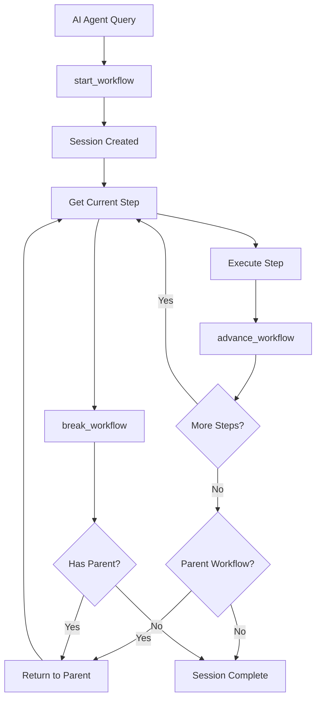

# Vibe MCP Workflow Server

A Model Context Protocol (MCP) server that provides step-by-step workflow orchestration using Vibe's intelligent workflow system.

## Overview

This MCP server solves the token throttling problem with AI agents by providing step-by-step workflow execution. Instead of receiving all workflow steps at once (which can consume thousands of tokens), agents receive one step at a time and can advance through workflows systematically.

## Features

- **Step-by-step workflow execution** - Reduces token usage by 90%+
- **Workflow session management** - Persistent state across interactions
- **Nested workflow support** - Call sub-workflows with automatic return to parent
- **Natural language workflow analysis** - Powered by Vibe's intelligent prompt analysis
- **JSON-based communication** - Clean, structured responses for AI agents

## Architecture

```
AI Agent (VSCode Copilot)
    ↓ MCP Protocol
MCP Workflow Server (Node.js)
    ↓ Shell commands
Vibe CLI (Python)
    ↓ YAML workflows
Workflow Definitions
```

## Installation

### Prerequisites

- Node.js 18+
- Python 3.13+ with Vibe installed
- UV package manager (for running Vibe)

### Setup

1. **Install dependencies**:
   ```bash
   cd mcp-server
   npm install
   ```

2. **Test the server**:
   ```bash
   npm run dev
   ```

3. **Configure in VSCode** (see Configuration section below)

## MCP Tools

### `start_workflow`

Start a new workflow session from a natural language prompt.

**Parameters:**
- `prompt` (required): Natural language description of what you want to accomplish
- `config` (optional): Path to Vibe configuration file
- `project_type` (optional): Project type override (python, vue_typescript, generic)
- `working_dir` (optional): Working directory to run commands in (defaults to current directory)
- `project_type` (optional): Override project type detection

**Example:**
```json
{
  "prompt": "analyze the project structure and run quality checks",
  "project_type": "python"
}
```

**Response:**
```json
{
  "success": true,
  "session_id": "abc12345",
  "current_step": {
    "workflow": "python_analysis",
    "step_number": 1,
    "step_text": "📄 **Discover Python files**: `find . -name '*.py'`",
    "is_command": true
  },
  "workflow_stack": ["python_analysis", "quality_check"],
  "total_workflows": 2
}
```

### `get_workflow_status`

Get current status and step information for a workflow session.

**Parameters:**
- `session_id` (required): Session ID from `start_workflow`

### `advance_workflow`

Mark current step complete and advance to next step.

**Parameters:**
- `session_id` (required): Session ID to advance

**Response:**
```json
{
  "success": true,
  "session_id": "abc12345",
  "current_step": {
    "workflow": "python_analysis",
    "step_number": 2,
    "step_text": "📈 **Count Python files**: `find . -name '*.py' | wc -l`",
    "is_command": true
  },
  "has_next": true
}
```

### `break_workflow`

Break out of current workflow and return to parent (if nested).

**Parameters:**
- `session_id` (required): Session ID to break

### `list_workflow_sessions`

List all active workflow sessions.

**No parameters required.**

## Workflow Session Lifecycle



## VSCode Configuration

Add to your VSCode `settings.json`:

```json
{
  "mcp.servers": {
    "vibe-workflow": {
      "command": "node",
      "args": ["/path/to/vibe/mcp-server/index.js"],
      "env": {
        "UV_PROJECT_ENVIRONMENT": "/path/to/vibe/.venv"
      }
    }
  }
}
```

## Usage Example

```javascript
// Start a workflow session
const startResult = await callTool('start_workflow', {
  prompt: 'implement user authentication with tests'
});

const sessionId = startResult.session_id;
let currentStep = startResult.current_step;

// Execute workflow step by step
while (currentStep) {
  console.log(`Step ${currentStep.step_number}: ${currentStep.step_text}`);

  // AI agent executes the step here
  if (currentStep.is_command) {
    // Execute command steps
  } else {
    // Process guidance steps
  }

  // Advance to next step
  const nextResult = await callTool('advance_workflow', { session_id: sessionId });

  if (!nextResult.has_next) {
    console.log('Workflow completed!');
    break;
  }

  currentStep = nextResult.current_step;
}
```

## Benefits for AI Agents

1. **Reduced Token Usage**: Instead of receiving 50+ workflow steps (2000+ tokens), agents receive 1 step at a time (50-100 tokens)

2. **State Persistence**: Workflow progress is maintained across interactions, so agents can't "forget" where they are

3. **Natural Language Interface**: Agents can start workflows using natural language instead of memorizing workflow names

4. **Nested Workflow Support**: Complex tasks can call sub-workflows automatically

5. **Error Recovery**: If an agent gets confused, it can break out of workflows or restart sessions

## Development

### Testing

```bash
# Test the MCP server directly
node test.js

# Test Vibe CLI integration
cd ..
uv run python test_mcp.py
```

### Adding New Tools

1. Add tool definition in `tools/list` handler
2. Add tool implementation in `tools/call` handler
3. Update this README with tool documentation

## Troubleshooting

### Common Issues

1. **"uv command not found"**: Install UV package manager or update PATH
2. **"Vibe module not found"**: Ensure Vibe is installed and accessible via `uv run python -m vibe.cli`
3. **Session not found**: Sessions are stored in `~/.vibe/sessions/` - check file permissions

### Debug Mode

Run with debug logging:
```bash
DEBUG=1 node index.js
```

## License

MIT License - see LICENSE file for details.
